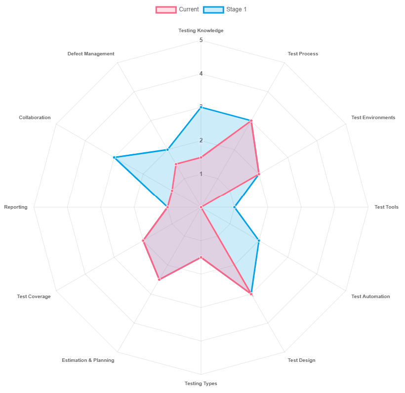

# Radar Diagram Generator

This project is a simple proof of concept for generating radar diagrams using Chart.js and a custom configuration file. You can use this project to create your own radar diagrams and screenshot them for use in your documents.

## Installation

To install this project, you need to have npm installed on your system. Then, follow these steps:

1. Clone this repository to your local machine.
2. Navigate to the project folder and run `npm install` to install the dependencies.
3. Edit the `configuration.json` file to your liking. You can change the datasets, colors, labels, and other options for the radar diagram.
4. Run `npm run dev` to start the development server and navigate to `http://localhost:1234`.
5. You should see your radar diagram displayed on the screen. You can screenshot it and save it as an image file.

## Example

## License

This project is licensed under the MIT License.
